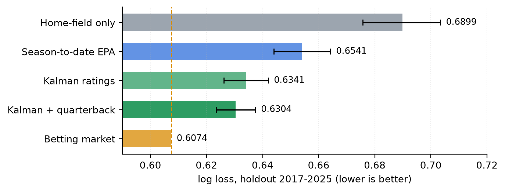
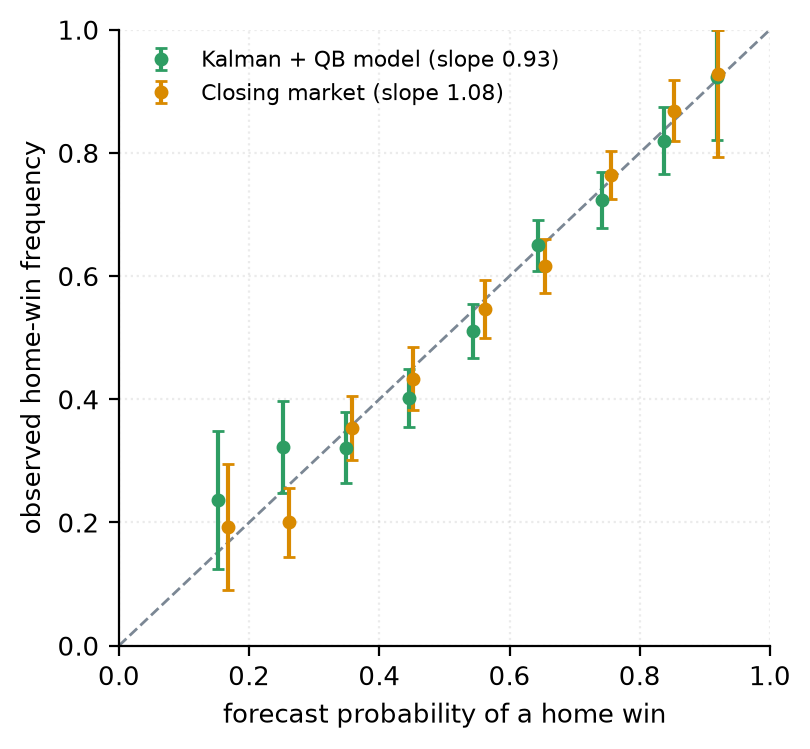
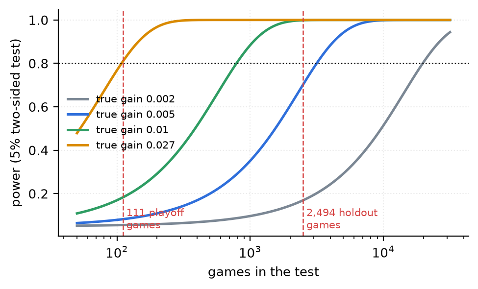
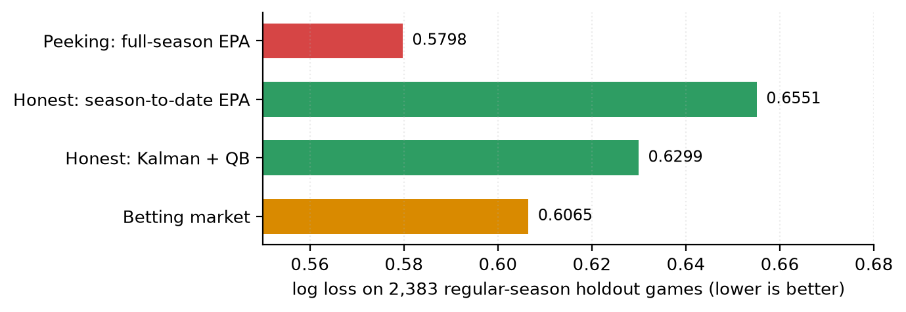
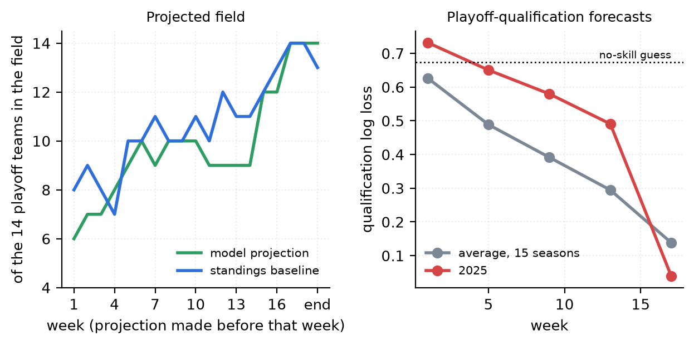
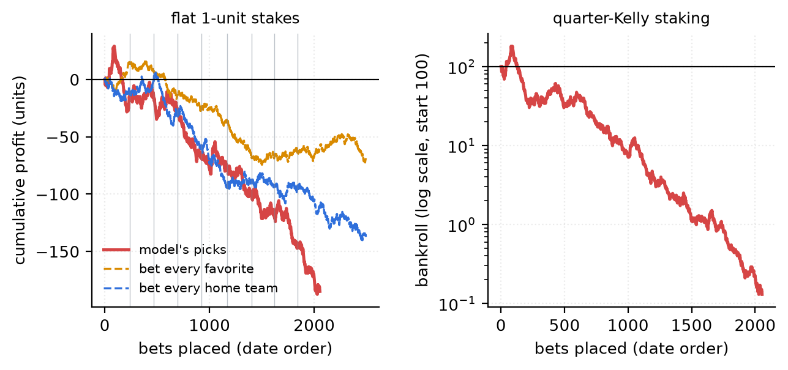

## Abstract {.unnumbered}

I build a leakage-controlled, fundamentals-only forecasting pipeline for NFL games and playoff outcomes, and spend most of the paper on how to tell whether it works. A Kalman filter on per-play expected points added (EPA), with a separate quarterback layer, feeds a logistic game model. Evaluated walk-forward on  held-out games (2017--2025,  of them postseason) it scores a log loss of , against  for home-field alone and  for the closing betting line; the  gap to the market is statistically clear (95% CI  to ). An encompassing regression finds no information in the model beyond the market, and betting the model's disagreements with closing moneylines loses % per bet ( bets; 95% CI % to %). Of  out-of-sample comparisons,  are nominally significant where about  would be expected by chance, and one, the Kalman rating filter with memory across seasons (versus season-to-date EPA), survives Holm and Benjamini--Hochberg correction on the holdout where it was found; on 2003--2009 seasons that had no part in its design it points the same way () but does not reach significance on its own. I show how season-final features make an EPA model look better than the market (log loss ), quantify what a 111-game postseason sample can and cannot detect, replay the model's projections for the January  playoff bracket against what happened (it picked  of  winners, the closing line , and a standings baseline matched its projected field for most of the season), and describe a hash-chained forward-test ledger and a live, self-updating bracket that began with the 2026 season. The contribution is methodological: a worked example of the evaluation discipline needed to trust, or reject, a sports forecasting claim.

## Introduction

Sports forecasting is a convenient laboratory for forecasting methodology. Outcomes arrive often enough to evaluate, a strong public benchmark exists (the betting market), and the temptations that wreck real forecasting work (look-ahead, tuning on the test set, trying many ideas and reporting the lucky one) are constant. I ask a narrow question, *how much of the market's information can a fundamentals-only model recover?*, and a broader one: *what evaluation discipline is required for the answer to be believable?*

The project began as a notebook whose headline accuracy turned out to be inflated by look-ahead: season-final player-grade aggregates were joined to every game of the same season. Rebuilding it as a pipeline in which every pregame feature is computed only from earlier games, and every claim is scored out-of-sample against a holdout whose use is logged and corrected for, changed the conclusions. I report both what the corrected model does and what the discipline revealed.

**Contributions.**

1. A leakage-controlled pipeline with a perturbation test for every feature builder, a walk-forward protocol, and a development/holdout split that is respected throughout (@sec-protocol).
2. Online Kalman team ratings on EPA per play with a travelling quarterback layer, and an honest measurement of their gap to the closing market (@sec-results-accuracy, @sec-market).
3. An experiment registry covering all  out-of-sample comparisons, corrected for multiple testing, with a power analysis that states what the sample can detect (@sec-registry, @sec-power).
4. An exact-enumeration bracket simulator and a full-season simulator with shared latent strength shocks, scored against historical futures prices and replayed on the January  bracket (@sec-simulation, @sec-replay-bracket).
5. A closing-line trading simulation with a Deflated Sharpe Ratio (@sec-trading).
6. A forward test with an append-only, hash-chained prediction ledger (@sec-forward).

**Related work.** My rating model is in the spirit of the state-space models of @glickman1998, using play-level EPA [@yurko2019] rather than score margins. I score probabilities with proper scoring rules [@brier1950; @gneiting2007], treat the betting market as a benchmark in the sense of the wagering-market literature [@sauer1998; @strumbelj2014], and borrow the multiple-testing and backtest-overfitting machinery developed for quantitative finance [@harvey2016; @baileylopezdeprado2014; @lopezdeprado2018].

## Data and leakage controls {#sec-data}

**Sources.** Play-by-play (1999 onward), schedules with closing lines, weekly injury reports (2009 onward), snap counts (2013 onward; the source has no 2012 rows), weekly rosters with game-day inactive status, player statistics and contract records come from the nflverse project. Closing spreads and moneylines are the schedule file's line columns, which hold the closing numbers once a game is played. Historical playoff futures prices (used *only* to score the bracket simulator) were collected from a public odds-history site for personal research and are not redistributed.

**Definitions that matter.** The postseason is defined by game type (Wild Card, Divisional, Conference, Super Bowl), never by week number. A game's pregame starting quarterback is the player who took the first snap in the play-by-play; the schedule's listed starter agrees 99.2% of the time but is noisier in 2024 and is used only as a cross-check. A missing injury report is *missing*, not zero (for example, the 2023 playoff weeks have none).

**Leakage controls.** Pregame features use only games from earlier (season, week) groups. Every feature builder has a *perturbation test*: the test rewrites every result after a chosen game, rebuilds the features, and asserts that the features for that game are unchanged to numerical precision. Evaluation stops at the last completed season; the season in progress is used only for the forward test.

## Methods

### Team and quarterback ratings {#sec-ratings}

Each team carries two latent strengths in EPA-per-play units: an offense $O_t$ (everything except the quarterback) and a defense $D_t$ (EPA allowed above average, so lower is better); each quarterback $k$ carries a strength $Q_k$ that travels with him between teams. A game contributes two observations. For the home offense,
$$
y_h = \mu + O_h + \sum_k s_k Q_k + D_a + \varepsilon_h, \qquad \varepsilon_h \sim \mathcal N\!\left(0,\; \sigma^2 \tfrac{n_0}{n_h}\right),
$$
where $s_k$ is quarterback $k$'s share of the team's dropbacks, $n_h$ the number of offensive plays and $n_0 = 62.7$ the league-average count; the away offense is symmetric. After each week the Kalman gain moves every state toward the observation in proportion to its prior uncertainty, which splits credit between team and quarterback and handles backups and trades correctly. Between games uncertainty drifts upward; between seasons states shrink toward the league mean, $x \leftarrow \lambda x$, and variances inflate, $P \leftarrow \lambda^2 P + q_{\text{season}}$, with separate carry-over $\lambda$ for offense (0.30), defense (0.70) and quarterbacks (0.85). Hyperparameters were tuned by coordinate descent on test seasons 2011--2016 only, on a very flat loss surface, and frozen before the 2017--2025 holdout was scored. A simplified one-dimensional version is illustrated in @fig-kalman.

{#fig-kalman width=85%}

### Game model

The home-win probability is a logistic regression on two rating differences,
$$
\Pr(\text{home win}) = \sigma\!\big(\beta_0 + \beta_1 \Delta(O{+}Q) + \beta_2 \Delta D\big),
$$
where $\Delta(O{+}Q)$ is home minus away offense-plus-quarterback strength and $\Delta D$ is away minus home defensive allowance. The intercept is the home-field term. The model is refit for each test season on earlier seasons only.

### Evaluation protocol {#sec-protocol}

*Population and metrics.* All models are compared on one common set of games, walk-forward, with log loss as the primary metric [@gneiting2007] and Brier score [@brier1950] and accuracy secondary. *Development and holdout.* Hyperparameters were tuned on 2011--2016 only and frozen. Test seasons 2002--2016 form the development window and 2017--2025 the holdout, but the two were not separated from the start: the Kalman model, its quarterback layer and roughly half of the experiments were built when 2017--2025 was the only test window (2026-09-30), and a formal split (select on 2002--2016, confirm on 2017--2025) was adopted on 2026-10-06 when history was extended to 1999. Every comparison in the registry is scored on the holdout window or later, so the holdout is *not sealed*: the multiple-testing correction below is applied to exactly those looks, and the main survivor is re-tested on seasons that had no part in its design (@sec-replication). *Uncertainty.* Differences between models are reported with paired bootstrap intervals over games [@efron1979], and with season-level resampling when the unit is a season (title odds). *Market benchmark.* Moneyline prices are converted to probabilities by proportional de-vigging; additive, power and Shin variants were also examined in a supporting analysis [@strumbelj2014].

### Postseason and season simulation {#sec-simmethods}

Each simulated season draws a latent strength shock $\epsilon_t \sim \mathcal N(0, \tau_t^2)$ for every team on the probit scale, shared by all of that team's games. The variance $\tau_t^2$ comes from the rating filter's own posterior variance. A game between $i$ and $j$ is won by $i$ with probability
$$
p(\epsilon) = \Phi\!\left(\frac{m_{ij} + \epsilon_i - \epsilon_j}{s_{ij}}\right), \qquad s_{ij}^2 = 1 - \tau_i^2 - \tau_j^2,
$$
where $m_{ij} = \Phi^{-1}(p_{ij})$ is the probit index of the fitted game model's single-game probability. By construction, averaging over the shocks returns $p_{ij}$ (marginal preservation), so single-game forecasts stay calibrated while a team's fortunes become correlated across rounds. Given the shocks the bracket is solved *exactly*: every combination of game outcomes with NFL reseeding is enumerated and collapsed by surviving-team set (Rao--Blackwellization), so the only Monte Carlo noise is in the shocks, reduced with scrambled Sobol points and antithetic pairs. A vectorized season simulator (65,536 seasons, random tiebreaks) produces playoff, division and title probabilities. Seeds for past brackets are reconstructed from schedules and validated against 17 real brackets.

### Multiple testing and power {#sec-multi}

Every out-of-sample comparison run in the project is logged in a registry with its effect (change in paired log loss) and interval. I recover a $p$-value from each interval under a normal approximation and control the family-wise error rate with Holm's procedure [@holm1979] and the false-discovery rate with Benjamini and Hochberg's [@benjamini1995]. For power, the standard deviation of per-game log-loss differences between two similar models is $\hat\sigma =$ , so a two-sided 5% test with 80% power over $n$ games detects a true improvement of about $2.8\,\hat\sigma/\sqrt n$.

### Trading simulation {#sec-tradingmethods}

For each game the simulated bettor takes the side with the larger expected value $\text{EV} = p(d-1) - (1-p)$ at decimal odds $d$ whenever EV exceeds a threshold. Staking is either one unit (flat) or quarter-Kelly capped at 5% of the bankroll [@kelly1956]. Prices are the real two-sided closing moneylines, with an average overround of %. The threshold is chosen on 2007--2016 and the holdout 2017--2025 is scored once. I report return per bet with a bootstrap interval, naive baselines that isolate the effect of the vig, the Sharpe ratio, and the Deflated Sharpe Ratio [@baileylopezdeprado2014] over all  strategy variants tried.

## Results

### Predictive accuracy {#sec-results-accuracy}

@tbl-scorecard and @fig-scorecard compare every model on the same  holdout games. Each added piece of structure helps: season-to-date EPA beats home-field alone, Kalman ratings beat season-to-date EPA, and the quarterback layer adds a little more. The closing line remains ahead of all of them.



: Holdout 2017--2025, common population of  games with a closing line. Gap = model minus market log loss with a 95% paired-bootstrap interval. {#tbl-scorecard}

{#fig-scorecard width=85%}

The champion model picks the winner % of the time versus % for the market and % for always choosing the home team. Accuracy ignores confidence, which is why log loss is the primary metric.

### What the market knows {#sec-market}

In an encompassing regression of outcomes on the logits of the market and model probabilities, the model's coefficient is  (95% CI  to , $p =$ ): the model adds no detectable information beyond the market. The two forecasts are strongly correlated ( on the logit scale), so individual coefficients in the joint fit are not separately interpretable; I therefore also report each forecaster's own calibration slope on the holdout:  for the model and  for the market (1 is perfect). @fig-calibration shows both are close to calibrated. The market's advantage is therefore not miscalibration but sharper, better-informed probabilities.

{#fig-calibration width=55%}

### Ideas tested, and the multiple-testing correction {#sec-registry}

@fig-registry lists all  comparisons: Kalman versus season-to-date ratings, the quarterback layer and its cuts, margin and heteroscedastic models, rest/bye/neutral-site features, garbage-time and leverage filtering, injury burden (report-based, injured-reserve and game-day inactives), recency-weighted training and market-calibration variants. One further comparison that used a licensed third-party dataset cannot be published; it showed no detectable effect and is not counted here.  are nominally significant at 5%, where chance alone would give about ; **one** survives Holm and Benjamini--Hochberg: cross-season Kalman ratings versus season-to-date EPA ().

{#fig-registry width=95%}

Three results deserve comment. First, the **quarterback layer** looked like a success (all games ; games where a starter changed , $p =$ ; regular season only ) but does not survive correction, and in the 111 postseason games it points the wrong way (). Second, **injury information** is weak: the report-based burden gives  and a two-stage EPA-residual adjustment , neither significant; game-day inactives were nominally significant (, $p =$ ) but do not survive correction and close only a small share of the gap to the market. Third, **margin-based and heteroscedastic models** (for example ) add nothing over the logistic model.

### Does the survivor replicate? {#sec-replication}

The Kalman filter was designed while 2017--2025 was the only test window, so its holdout result is not a clean confirmation of the architecture. I therefore pre-specified (before computing it) a check on test seasons 2003--2009, which played no part in designing the filter or tuning its hyperparameters (tuned on 2011--2016): the same comparison as E01, with a 95% paired-bootstrap interval excluding zero as the primary criterion. @tbl-replication shows the result. On  games the gain is : the same sign, about half the size seen later, and an interval that just touches zero, so **the pre-specified criterion is not met**. The development window (2002--2016) gives  and the holdout, under the same 2000-onward training used for this check,  (E01 uses the live model's 2010 training start). I read the evidence as consistent in direction across windows but not independently confirmed at the 5% level; the replication has little power to detect effects much smaller than its point estimate.



: Replication of E01 (Kalman ratings versus season-to-date EPA; negative favors Kalman). Primary check: 2003--2009. {#tbl-replication}

### What the sample can detect {#sec-power}

With  postseason games a reliable test detects only improvements above about  log loss; with  holdout games, above . Confirming a true improvement of 0.005 would take about  games and one of 0.002 about  games (roughly  seasons) (@fig-power). Many "no effect" results above are therefore best read as *no detectable effect*.

{#fig-power width=65%}

### Look-ahead leakage {#sec-leakage}

@fig-leakage reproduces the original design mistake using only public EPA data. Rating each team by its *full-season* net EPA per play and then "predicting" regular-season games from that season yields a log loss of  on  holdout games, better than the closing market. The honest equivalent that uses only games before kickoff scores , a difference of  that reflects information from the future.

{#fig-leakage width=70%}

### Simulating the postseason and the title {#sec-simulation}

Against historical futures prices, the bracket simulator is scored by $-\ln P(\text{actual winner})$ in each market and round (@tbl-bracket). The simulator trails the futures price in  of  market-and-round cells; the exception is the Super Bowl winner once the finalists are known, where the model is marginally better ($-0.019$), a single cell. With only nine seasons per cell I treat these as descriptive. The season simulator's title odds trail the market in every logged week by about 0.2 to 0.3 in log score ( pooled, 95% CI  to , resampling nine holdout seasons), a difference I cannot distinguish from zero (@tbl-title). Playoff-qualification probabilities agree with outcomes on average: mean predicted  versus observed  across  team-snapshots.



: Bracket simulator versus historical futures prices, holdout 2017--2025 (mean $-\ln P$(winner); lower is better). Differences are descriptive, based on nine seasons. {#tbl-bracket}



: Season-simulator title odds versus the market's price for the same week, scored on the champion ($-\ln P$; lower is better), 2017--2025. {#tbl-title}

### Replaying the January  bracket {#sec-replay-bracket}

The playoffs held in January  belonged to the  season. To see what the machinery would have shown, I rewound it to  points in that season (before each week, and after the last) and, at each, asked for the bracket field it would draw: the lineup of seven teams per conference that maximizes the expected number of correct seeds under the season simulation. Every projection uses only earlier games (ratings are walk-forward and the game model is refit on earlier games). I scored them against the real field, against a naive baseline (the field if the season ended today, with ties broken by point differential rather than the NFL's full rules), and, for the playoffs themselves, against the closing line and a higher-seed rule.

*The projected field.* @tbl-br-field and @fig-br-replay show the result. Before week 1 the model's field contained  of the 14 teams that eventually qualified, against  for last year's field; by the last weeks both had  or . Across the  projections the model had more of the real playoff teams than the standings in , fewer in  and the same number in , so in  the simulation did not clearly beat looking at the standings. It was also a hard year for the model's own qualification probabilities: log loss was  at week 1 and  at week 9, against  and  averaged over  seasons, and a no-skill guess of the league-wide qualification rate scores .



: Projected field versus the real  playoff field. "In field" counts the 14 eventual playoff teams that were projected (any seed); "exact seed" counts teams projected at their final seed. {#tbl-br-field}

{#fig-br-replay width=95%}

*The bracket and the games.* Filled in before the Wild Card round, with the model's favorite in every game, the bracket got  of 13 winners right (a pick counts if that team wins in that round); always picking the higher seed got . It picked  to win the Super Bowl;  won, to whom it had given %, ranking  of the 14 teams. With the real matchups known, the model picked  of  winners with log loss , against  and  for the closing line (@tbl-br-games).



: The  playoff games. Log loss is on the home team's win; a coin flip scores 0.693. {#tbl-br-games}

Thirteen games are far too few to say anything about skill: a record of  of  is consistent with true accuracy anywhere from about % to % (95% Wilson interval), and one game separates the model from the market. This replay shows what one bracket looked like. The season-long scorecard in @sec-results-accuracy is the evidence about skill.

### Could the model have made money? {#sec-trading}

No. Betting the model's larger-EV side against closing moneylines returns % per bet over  holdout bets (95% CI % to %;  units under flat staking). Betting every favorite returns % (CI % to %) and every home team %, so naive strategies lose roughly three to five percent per bet. The model's picks, which are on the favorite only % of the time, do  points worse than betting the favorite on the same games (95% CI  to ), a difference I cannot distinguish from zero: the claim is "no better than naive", not "reliably worse". Quarter-Kelly staking takes a bankroll of 100 to . The Sharpe ratio per bet is  and the Deflated Sharpe Ratio over  variants is  (@fig-betting). The same rule returned roughly zero (about $-0.5$%, interval spanning zero) on the 2007--2016 development window; neither the 2019--2021 empty-stadium seasons nor a drifting home edge explains the gap (recency-weighted training changes holdout log loss by at most 0.0003).

{#fig-betting width=95%}

### Forward test {#sec-forward}

Predictions for the 2026 season are written to an append-only CSV before kickoff. Each row stores the SHA-256 of its own fields concatenated with the previous row's hash, and the file is committed to version control after every logging run, so any edit to an earlier row changes every later hash. A separate chain stores title odds from the season simulator. A companion site (<https://acharles1070.github.io/nfl-playoff-model/bracket/>) shows the live bracket for the January 2027 playoffs, rebuilt every morning from fresh data by a scheduled job: a projection until the playoff schedule exists, then the real field with scores and re-simulated odds. Its regular-season numbers equal the logged title odds. Logging runs on a schedule (Wednesday champion model and title odds; Friday injury-aware challenger). As of this writing  predictions are logged and  champion-model games have finished, on which the model scores  log loss against  for the market at logging time: far too few games to say anything. The point of the ledger is the record being built.

## Discussion

**What I learned.** (i) Measurement discipline mattered more than modeling cleverness: a model with no skill beyond season-long EPA appears to beat the market once the future leaks in. (ii) The only improvement that survives correction is the Kalman rating filter with cross-season memory ( versus season-to-date EPA), and the market is still better than my best model by  log loss. That survivor was found on the holdout and points the same way, but not significantly, on seasons outside its design (@sec-replication). (iii) After correcting for the number of ideas tried, almost nothing else helps, and the sample is too small to prove that small effects are absent. (iv) The market's closing price is a very high bar: the model's information is a subset of it, and betting the difference loses money.

**Limitations.** The bracket replay covers a single season (13 games). The holdout contains only  postseason games and was examined for every idea tried, so it is not sealed; the Kalman architecture was settled on it before the formal development/holdout split existed. The live champion and the simulators train from 2010, whereas the experiment harness added in October trains from 2000 (the E01 replication needs the earlier start), so a few numbers differ slightly by design. Several diagnostics (E35--E38) were motivated by holdout results and are labelled *post hoc*. I compare against closing lines; whether earlier prices are less efficient was not tested. Normal-approximation $p$-values from bootstrap intervals are used for the registry. The betting simulation assumes bets at the quoted closing price with no limits or slippage and is a statistical exercise, not betting advice.

**Errata.** Building the bracket replay exposed a leak in my first version: when no regular-season games remained, the rating snapshot included every game played, playoffs included, so pre-playoff odds were contaminated by the results they were meant to predict (it made the eventual champion look like the clear favorite). Replayed numbers in this paper are from the corrected code, which agrees with the independent multi-season backtest to three decimals at every comparable checkpoint, and a regression test checks that pre-playoff ratings are identical whether or not the playoffs are in the schedule. Separately, while building the interactive companion I found that neutral-site (Super Bowl) probabilities in the simulators subtracted only the logistic intercept and ignored the feature-standardization shift, biasing every neutral-site logit by about $-0.015$ (about 0.4 points at 50%). It was fixed, versioned (`season_sim_v2`) and covered by a regression test; backtest scores moved by at most 0.003 (`docs/CHANGELOG.md`).

**Next.** A separate model that *uses* market prices as an input (a stacking or calibration layer) is a different question from the one asked here. The forward test will accumulate roughly 285 games per model per season; the registry and pre-registered adoption rules will carry forward so that each year's changes are scored on data the previous year's model never saw.

## Reproducibility and disclosures {.unnumbered}

All code, tests and ledgers are in the project repository (<https://github.com/acharles1070/nfl-playoff-model>); every figure, table and number in this paper is generated from the pipeline's outputs (`python -m src.simulation.bracket_replay && python -m src.report.site_data && python -m src.report.paper_assets`; the live bracket is `python -m src.simulation.live_bracket`, built from commit `` on ). The pipeline rebuilds in about 15 seconds and ships with an automated test suite, including a perturbation test for every feature builder. I developed this work with the assistance of an AI coding assistant (Claude); I am responsible for the design decisions and conclusions, and all results are reproducible from the code. Nothing here is betting or financial advice.
